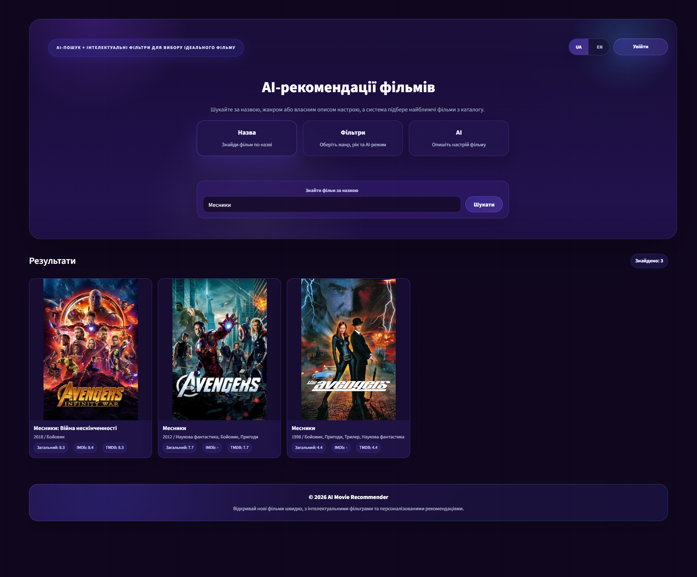
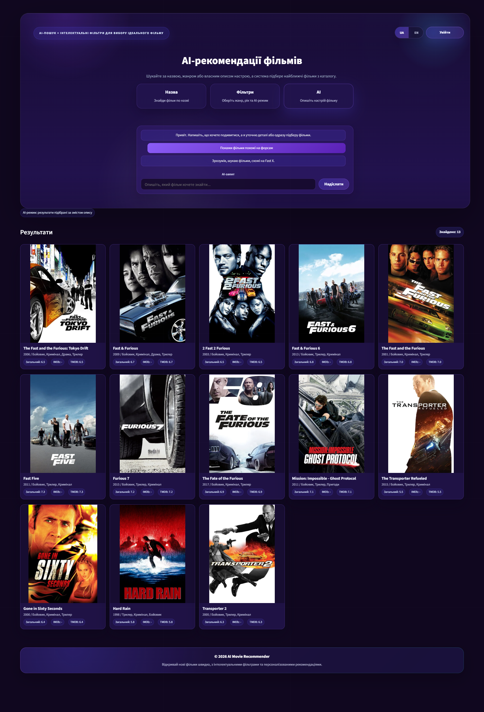
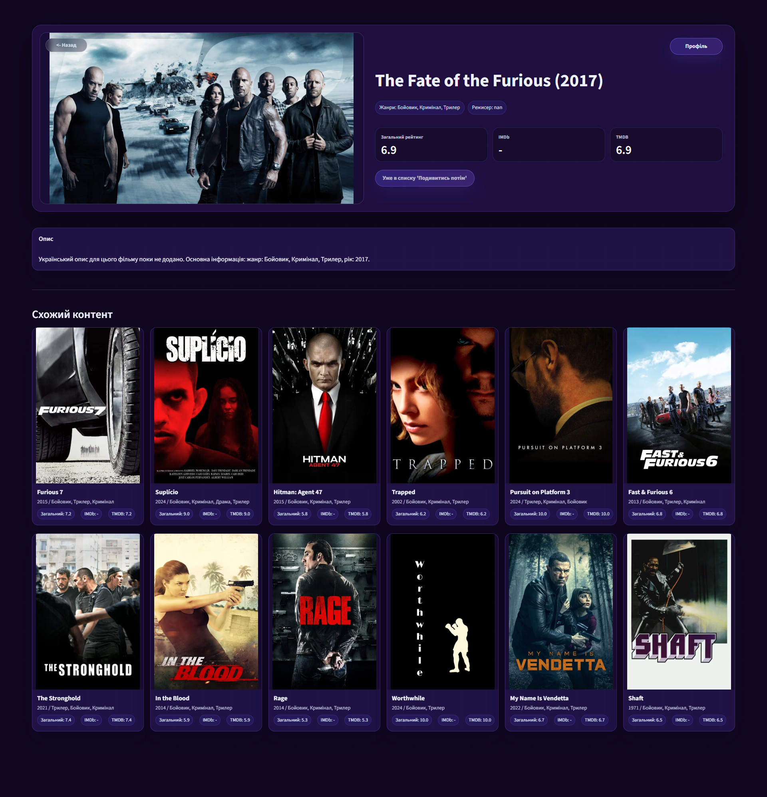

# Розроблення рекомендаційної системи мультимедійного контенту на базі алгоритмів штучного інтелекту


---

## Автор

- **ПІБ**: Павлик Остап Іванович
- **Група**: ФеС-41
- **Керівник**: доц. Бойко Ярослав Васильович
- **Дата виконання**: 28.05.2026

---

## Загальна інформація

- **Тип проєкту**: Розроблення рекомендаційної системи мультимедійного контенту на базі алгоритмів штучного інтелекту
- **Мова програмування**: Python
- **Основний фреймворк**: Streamlit
- **База даних**: MongoDB
- **Алгоритми рекомендацій**: TF-IDF, cosine similarity, контентно-орієнтована фільтрація
- **Джерела даних**: IMDb datasets, TMDB metadata, локальний підготовлений CSV-каталог

---

## Опис функціоналу

- Пошук фільмів за назвою українською або англійською мовою.
- Фільтрація фільмів за жанром, роком випуску та рейтингами.
- AI-чат для природномовних запитів: наприклад, "покажи новий бойовик", "фільми схожі на Гаррі Поттера", "фентезі без бойовика".
- Запам'ятовування контексту в AI-чаті під час діалогу.
- Пошук схожих фільмів за змістом, жанрами, описом і тематичними ознаками.
- Сторінка деталей фільму з постером, описом, жанрами, режисером і рейтингами IMDb/TMDB.
- Реєстрація та авторизація користувачів.
- Профіль користувача зі списком збережених фільмів.
- Список "Подивитись потім".
- Перемикання мови інтерфейсу UA / EN.
- Українські назви та описи фільмів, якщо переклад є в локальних даних.

---

## Опис основних файлів

| Файл | Призначення |
|---|---|
| `app/streamlit_app.py` | Основний Streamlit-додаток: інтерфейс, AI-чат, авторизація, профіль, сторінки фільмів |
| `utils/preprocessing.py` | Завантаження, очищення та підготовка каталогу фільмів |
| `models/content_based.py` | Контентно-орієнтовані рекомендації, TF-IDF, cosine similarity, пошук за описом |
| `models/hybrid.py` | Гібридне ранжування рекомендацій |
| `models/collaborative.py` | Заготовка для колаборативної фільтрації |
| `scripts/start_mongo_27018.ps1` | Запуск локального MongoDB на порту `27018` |
| `main.py` | Консольний приклад запуску рекомендацій |
| `requirements.txt` | Python-залежності проєкту |
| `data/movie_catalog_12000_fresh-rated-v1.csv` | Підготовлений каталог фільмів для роботи застосунку |

---

## Як запустити проєкт з нуля

### 1. Встановлення інструментів

Потрібно встановити:

- Python 3.11 або новіший;
- MongoDB Server;
- Git;
- браузер для відкриття Streamlit-додатку.

> У проєкті MongoDB використовується на порту `27018`, щоб не конфліктувати з іншими локальними сервісами.

### 2. Клонування репозиторію

```bash
git clone https://github.com/PavlykOstap/diploma.git
cd diploma
```

### 3. Створення та активація віртуального середовища

```bash
python -m venv .venv
```

Для Windows PowerShell:

```powershell
.\.venv\Scripts\Activate.ps1
```

### 4. Встановлення залежностей

```bash
pip install -r requirements.txt
```

### 5. Запуск MongoDB

Якщо MongoDB встановлено стандартно, можна запустити готовий скрипт:

```powershell
.\scripts\start_mongo_27018.ps1
```

Скрипт запускає MongoDB з такими параметрами:

```text
mongodb://localhost:27018/
```

База даних застосунку:

```text
ai_movie_recommender
```

Основна колекція:

```text
users
```

У цій колекції зберігаються користувачі, email, хеш пароля та список `watch_later`.

### 6. Запуск вебзастосунку

```bash
streamlit run app/streamlit_app.py
```

Після запуску сайт буде доступний у браузері:

```text
http://localhost:8501
```

---

## Дані

У проєкті використовується локально підготовлений каталог:

```text
data/movie_catalog_12000_fresh-rated-v1.csv
```

Каталог містить:

- назви фільмів;
- роки випуску;
- жанри;
- описи;
- постери;
- рейтинги IMDb та TMDB;
- популярність;
- режисерів;
- українські переклади назв та описів, якщо вони доступні.

Сирі IMDb/TMDB-дані можуть бути великими, тому для роботи застосунку використовується вже підготовлений CSV-файл.

Data courtesy of IMDb.

---

## Алгоритм рекомендацій

Рекомендаційна система працює за контентно-орієнтованим підходом.

Основні етапи:

1. Завантаження каталогу фільмів.
2. Очищення та нормалізація текстових полів.
3. Формування текстового опису фільму з назви, жанрів, опису, ключових слів та інших характеристик.
4. Перетворення тексту у числові вектори за допомогою TF-IDF.
5. Обчислення схожості між фільмами через cosine similarity.
6. Додаткове ранжування за роком, рейтингом, популярністю та запитом користувача.
7. Виведення найбільш релевантних фільмів у вебінтерфейсі.

AI-чат не є окремою великою мовною моделлю. У межах цього проєкту він реалізований як інтелектуальний модуль обробки природномовних запитів: система визначає жанри, виключення, новизну, якість, схожість на конкретний фільм і перетворює це у параметри пошуку.

---

## Приклади запитів в AI-чаті

```text
Покажи фільми схожі на Гаррі Поттера
```

```text
Але з нових
```

```text
Хочу фентезі, але без бойовика
```

```text
Дай бойовик з хорошим рейтингом
```

```text
Забудь про все, дай фільм про музику
```

---

## Внутрішні функції замість REST API

Проєкт не використовує окремий REST API, оскільки інтерфейс і логіка працюють у межах Streamlit-додатку. Основні операції реалізовані через Python-функції.

| Функція | Призначення |
|---|---|
| `register_user()` | Реєстрація нового користувача |
| `authenticate_user()` | Перевірка логіна та пароля |
| `get_current_user()` | Отримання поточного авторизованого користувача |
| `add_watch_later()` | Додавання фільму у список "Подивитись потім" |
| `remove_watch_later()` | Видалення фільму зі списку |
| `get_content_recommendations()` | Пошук схожих фільмів |
| `search_by_description()` | Пошук фільмів за текстовим описом |
| `build_chat_reply()` | Обробка повідомлення AI-чату |

---

## Інструкція для користувача

1. Відкрити головну сторінку застосунку.
2. Обрати один із режимів:
   - **Назва** - пошук конкретного фільму;
   - **Фільтри** - вибір жанру, року та сортування;
   - **AI** - пошук фільмів через звичайне текстове повідомлення.
3. Натиснути на картку фільму, щоб перейти на сторінку деталей.
4. Увійти або зареєструватися, щоб зберігати фільми.
5. На сторінці фільму натиснути "Додати в Подивитись потім".
6. У профілі переглянути збережені фільми.
7. За потреби перемкнути мову сайту між UA та EN.

---

## Можливі проблеми і рішення

| Проблема | Рішення |
|---|---|
| `mongod` не розпізнається як команда | Встановити MongoDB Server або запускати `scripts/start_mongo_27018.ps1`, де вказано повний шлях до `mongod.exe` |
| MongoDB недоступна | Перевірити, чи запущено сервер на `mongodb://localhost:27018/` |
| Після реєстрації користувач не зберігається | Перевірити базу `ai_movie_recommender` і колекцію `users` |
| Streamlit не запускається | Виконати `pip install -r requirements.txt` у активованому `.venv` |
| Постери не відображаються | Перевірити доступ до інтернету та наявність poster URL у CSV-каталозі |
| Пошук не знаходить українську назву | Переконатися, що для фільму є українська назва або alias у коді |

---

## Використані джерела

- [Streamlit Documentation](https://docs.streamlit.io/)
- [pandas Documentation](https://pandas.pydata.org/docs/)
- [NumPy Documentation](https://numpy.org/doc/)
- [scikit-learn Documentation](https://scikit-learn.org/stable/)
- [MongoDB Documentation](https://www.mongodb.com/docs/)
- [PyMongo Documentation](https://pymongo.readthedocs.io/)
- [IMDb Non-Commercial Datasets](https://www.imdb.com/interfaces/)
- [TMDB](https://www.themoviedb.org/)

---

## Screenshots

### Пошук за назвою



### Фільтрація фільмів


### AI-рекомендації схожих фільмів


### AI-рекомендації за прикладом фільму



### Сторінка деталей фільму


